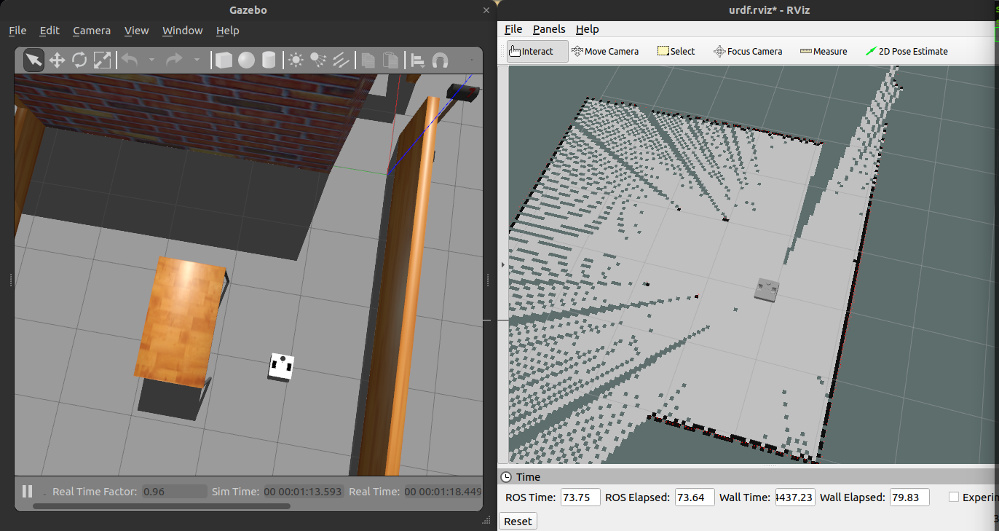

<!-- Improved compatibility of back to top link: See: https://github.com/othneildrew/Best-README-Template/pull/73 -->
<a name="readme-top"></a>
<!--
*** Thanks for checking out the Best-README-Template. If you have a suggestion
*** that would make this better, please fork the repo and create a pull request
*** or simply open an issue with the tag "enhancement".
*** Don't forget to give the project a star!
*** Thanks again! Now go create something AMAZING! :D
-->


<!-- PROJECT SHIELDS -->
<!--
*** I'm using markdown "reference style" links for readability.
*** Reference links are enclosed in brackets [ ] instead of parentheses ( ).
*** See the bottom of this document for the declaration of the reference variables
*** for contributors-url, forks-url, etc. This is an optional, concise syntax you may use.
*** https://www.markdownguide.org/basic-syntax/#reference-style-links
-->
[![Contributors][contributors-shield]][contributors-url]
[![Forks][forks-shield]][forks-url]
[![Stargazers][stars-shield]][stars-url]
[![Issues][issues-shield]][issues-url]
[![LinkedIn][linkedin-shield]][linkedin-url]


<!-- PROJECT LOGO -->
<br />
<div align="center">
  <a href="https://github.com/atom-robotics-lab/assets/blob/main/logo_1.png?raw=true">
    
  </a>

<h3 align="center">MR Robot</h3>

  <p align="center">
    This is the repo for the <a href="https://github.com/atom-robotics-lab/MR-Robot">MR-Robot: ModulaR Robot</a> Project, Mr robot is autonomous navigation robot made by A.T.O.M Robotics capable of doing multiple day to day operations such as mapping, navigation for transportation, sanitaion etc. Various other operations can also be performed thanks to its modularity.
    If you’re interested in helping to improve our Project</a>, find out how to <a href="https://github.com/atom-robotics-lab/MR-Robot/blob/main/contributing.md">contribute<a>. 
    <br />
    <a href=""><strong>Demo video »</strong></a>
    <br />
    <br />
    <a href="https://github.com/atom-robotics-lab/MR-Robot/issues/new?labels=bug&assignees=jasmeet0915,Kartik9250,insaaniManav,namikxgithub">Report Bug</a>
    ·
    <a href="https://github.com/atom-robotics-lab/MR-Robot/issues/new?labels=enhancement&assignees=jasmeet0915,Kartik9250,insaaniManav,namikxgithub">Request Feature</a>
  </p>
</div>


<!-- TABLE OF CONTENTS -->
<details>
  <summary>Table of Contents</summary>
  <ol>
    <li>
      <a href="#about-the-project">About The Project</a>
      <ul>
        <li><a href="#built-with">Built With</a></li>
      </ul>
    </li>
    <li>
      <a href="#getting-started">Getting Started</a>
      <ul>
        <li><a href="#prerequisites">Prerequisites</a></li>
        <li><a href="#installation">Installation</a></li>
      </ul>
    </li>
    <li><a href="#usage">Usage</a></li>
    <li><a href="#roadmap">Roadmap</a></li>
    <li><a href="#contributing">Contributing</a></li>
    <li><a href="#contact">Contact</a></li>
    <li><a href="#acknowledgments">Acknowledgments</a></li>
  </ol>
</details>


<!-- ABOUT THE PROJECT -->
## About The Project

This is the repo for the <a href="https://github.com/atom-robotics-lab/MR-Robot">MR-Robot: ModulaR Robot</a> Project, Mr robot is autonomous navigation robot made by A.T.O.M Robotics capable of doing multiple day to day operations such as mapping, navigation for transportation, sanitaion etc. Various other operations can also be performed thanks to its modularity.
If you’re interested in helping to improve our Project</a>, find out how to <a href="https://github.com/atom-robotics-lab/MR-Robot/contributing.md">contribute<a>.   

<p align="right">(<a href="#readme-top">back to top</a>)</p>


### Built With

* [](https://www.sphinx-docs.org)
* [](https://opencv.org/)
* [](https://www.blender.org/)
* [](https://www.raspberrypi.org/)
* [](https://www.espressif.com/)
* [](https://www.arduino.cc/)
* [](https://ubuntu.com/)
* [](https://www.python.org/)

<p align="right">(<a href="#readme-top">back to top</a>)</p>


<!-- GETTING STARTED -->
## Getting Started

This is an example of how you may give instructions on setting up your project locally.
To get a local copy up and running follow these simple example steps.

### Prerequisites

This is an example of how to list things you need to use the software and how to install them.
* Ros
  - Refer to our [Ros installation guide](https://atom-robotics-lab.github.io/wiki/markdown/ros/installation.html)
  - Installing Navigation specific dependencies: map-server, move_base and amcl
    ```sh
    sudo apt install ros-noetic-map-server ros-noetic-move-base ros-noetic-amcl
    ```

* Opencv
  ```sh
  sudo apt install libopencv-dev python3-opencv
  ```

### Installation

1. Clone the repo inside your `Ros Workspace`
   ```sh
   git clone git@github.com:atom-robotics-lab/MR-Robot.git
   cd wiki
   ```
2. Build the package
   ```sh
   cd ~/catkin_ws
   catkin_make
   ```
3. Launch the packages file by
   ```sh
   roslaunch <package_name> <launch_file>
   ```

<p align="right">(<a href="#readme-top">back to top</a>)</p>


<!-- USAGE EXAMPLES -->
## Usage

Use this space to show useful examples of how a project can be used. Additional screenshots, code examples and demos work well in this space. You may also link to more resources.

- The `mr_robot_description` dir contains all the bot model description files.
- The `mr_robot_gazebo` dir contains all the world description files.
- The `mr_robot_nav` dir contains all the config files for enabling navigation and planning.

<center></center></br></br>

In order to run the simulation you are required to do the following:</br>

* For running the `navigation simulation`.

  - Switch to the main branch of the repository.
    ```sh
    git checkout main
    ```
  - Launch the gazebo world.
    ```sh
    roslaunch mr_robot_gazebo turtlebot3_house.launch
    ```
  - Launch the navigation file.
    ```sh
    roslaunch mr_robot_nav navigation.launch
    ```
    **_NOTE:_** Make sure that you have installed the navigation dependencies before running the navigation launch file.<br />

  - Setting the goal
    In the Rviz add a 2d on the map.<br /> <br />

  Voila! The bot will start moving towards the goal now.<br /><br />

* For running `Octomapping simulation`.

  - Switch to the point_cloud_navigation branch.
    ```sh
    git checkout point_cloud_navigation
    ```

<p align="right">(<a href="#readme-top">back to top</a>)</p>


<!-- ROADMAP -->
## Roadmap

- [x] Alpha version
- [x] Version 1
    - [x] Adding camera
    - [x] Adding 3d camera
    - [ ] Hardware prototype

See the [open issues](https://github.com/atom-robotics-lab/MR-Robot/issues) for a full list of proposed features (and known issues).

<p align="right">(<a href="#readme-top">back to top</a>)</p>


<!-- CONTRIBUTING -->
## Contributing

Contributions are what make the open source community such an amazing place to learn, inspire, and create. Any contributions you make are **greatly appreciated**.

If you have a suggestion that would make this better, please fork the repo and create a pull request. You can also simply open an issue with the tag "enhancement".
Don't forget to give the project a star! Thanks again!

1. Fork the Project
2. Create your Feature Branch (`git checkout -b feature/AmazingFeature`)
3. Commit your Changes (`git commit -m 'Add some AmazingFeature'`)
4. Push to the Branch (`git push origin feature/AmazingFeature`)
5. Open a Pull Request

For more info refer to [contributing.md](https://github.com/atom-robotics-lab/MR-Robot/blob/main/contributing.md)
<p align="right">(<a href="#readme-top">back to top</a>)</p>


<!-- CONTACTS -->
## Contacts

Our Socials - [Linktree](https://linktr.ee/atomlabs) - atom@inventati.org

Demo: [Video]("")

<p align="right">(<a href="#readme-top">back to top</a>)</p>


<!-- ACKNOWLEDGMENTS-->
## Acknowledgement

* [Our wiki](https://atom-robotics-lab.github.io/wiki)
* [ROS Official Documentation](http://wiki.ros.org/Documentation)
* [Opencv Official Documentation](https://docs.opencv.org/4.x/)
* [Rviz Documentation](http://wiki.ros.org/rviz)
* [Gazebo Tutorials](https://classic.gazebosim.org/tutorials)
* [Ubuntu Installation guide](https://ubuntu.com/tutorials/install-ubuntu-desktop#1-overview)
* [Raspberrypi Documentation](https://www.raspberrypi.com/documentation/)
* [Esp32 Documentation](https://docs.espressif.com/projects/esp-idf/en/latest/esp32/)
* [Blender Documentaion](https://docs.blender.org/)

<p align="right">(<a href="#readme-top">back to top</a>)</p>


<!-- MARKDOWN LINKS & IMAGES -->
<!-- https://www.markdownguide.org/basic-syntax/#reference-style-links -->
[contributors-shield]: https://img.shields.io/github/contributors/atom-robotics-lab/MR-Robot.svg?style=for-the-badge
[contributors-url]: https://github.com/atom-robotics-lab/MR-Robot/graphs/contributors
[forks-shield]: https://img.shields.io/github/forks/atom-robotics-lab/MR-Robot.svg?style=for-the-badge
[forks-url]: https://github.com/atom-robotics-lab/wiki/network/members
[stars-shield]: https://img.shields.io/github/stars/atom-robotics-lab/MR-Robot.svg?style=for-the-badge
[stars-url]: https://github.com/atom-robotics-lab/wiki/stargazers
[issues-shield]: https://img.shields.io/github/issues/atom-robotics-lab/MR-Robot.svg?style=for-the-badge
[issues-url]: https://github.com/atom-robotics-lab/MR-Robot/issues
[linkedin-shield]: https://img.shields.io/badge/-LinkedIn-black.svg?style=for-the-badge&logo=linkedin&colorB=555
[linkedin-url]: https://www.linkedin.com/company/a-t-o-m-robotics-lab/