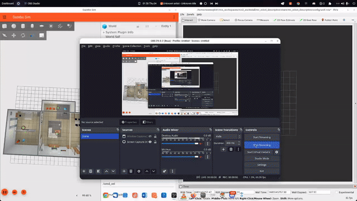
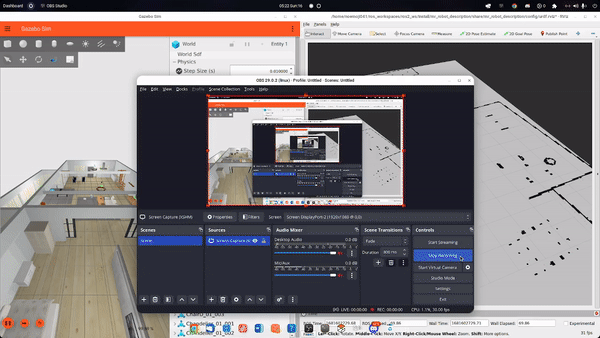

<!-- Improved compatibility of back to top link: See: https://github.com/othneildrew/Best-README-Template/pull/73 -->
<a name="readme-top"></a>
<!--
*** Thanks for checking out the Best-README-Template. If you have a suggestion
*** that would make this better, please fork the repo and create a pull request
*** or simply open an issue with the tag "enhancement".
*** Don't forget to give the project a star!
*** Thanks again! Now go create something AMAZING! :D
-->


<!-- PROJECT SHIELDS -->
<!--
*** I'm using markdown "reference style" links for readability.
*** Reference links are enclosed in brackets [ ] instead of parentheses ( ).
*** See the bottom of this document for the declaration of the reference variables
*** for contributors-url, forks-url, etc. This is an optional, concise syntax you may use.
*** https://www.markdownguide.org/basic-syntax/#reference-style-links
-->
[![Contributors][contributors-shield]][contributors-url]
[![Forks][forks-shield]][forks-url]
[![Stargazers][stars-shield]][stars-url]
[![Issues][issues-shield]][issues-url]
[![LinkedIn][linkedin-shield]][linkedin-url]


<!-- PROJECT LOGO -->
<br />
<div align="center">
  <a href="https://github.com/atom-robotics-lab/assets/blob/main/logo_1.png?raw=true">
    
  </a>

<h3 align="center">MR Robot</h3>
</div>


<!-- TABLE OF CONTENTS -->
<details>
  <summary>Table of Contents</summary>
  <ol>
    <li>
      <a href="#about-the-project">About The Project</a>
      <ul>
        <li><a href="#built-with">Built With</a></li>
      </ul>
    </li>
    <li>
      <a href="#getting-started">Getting Started</a>
      <ul>
        <li><a href="#prerequisites">Prerequisites</a></li>
        <li><a href="#installation">Installation</a></li>
      </ul>
    </li>
    <li><a href="#usage">Usage</a></li>
    <li><a href="#roadmap">Roadmap</a></li>
    <li><a href="#contributing">Contributing</a></li>
    <li><a href="#contact">Contact</a></li>
    <li><a href="#acknowledgments">Acknowledgments</a></li>
  </ol>
</details>


<!-- ABOUT THE PROJECT -->
## About The Project

This is our repo for the <a href="https://github.com/atom-robotics-lab/MR-Robot">MR-Robot: ModulaR Robot</a> Project, which is a ROS 2 based AMR actively being developed by A.T.O.M Robotics Lab.   
<p align="center">
    <a href=""><strong>Demo video »</strong></a>
    <br />
    <a href="https://github.com/atom-robotics-lab/MR-Robot/issues/new?labels=bug&assignees=jasmeet0915,Kartik9250,insaaniManav,namikxgithub">Report Bug</a>
    ·
    <a href="https://github.com/atom-robotics-lab/MR-Robot/issues/new?labels=enhancement&assignees=jasmeet0915,Kartik9250,namikxgithub">Request Feature</a>
  </p>
<p align="right">(<a href="#readme-top">back to top</a>)</p>

### Built With

* [](https://www.sphinx-docs.org)
* [](https://opencv.org/)
* [](https://www.blender.org/)
* [](https://www.raspberrypi.org/)
* [](https://www.espressif.com/)
* [](https://www.arduino.cc/)
* [](https://ubuntu.com/)
* [](https://www.python.org/)

<p align="right">(<a href="#readme-top">back to top</a>)</p>


<!-- GETTING STARTED -->
## Getting Started

### Prerequisites

* [ROS 2](https://docs.ros.org/en/humble/index.html) (Currently this based on Humble so we recommend installing that)
* [Gz Sim](https://gazebosim.org/docs) (Currenlt the simulation is based on Gz Sim Garden)
* [ros_gz](https://github.com/gazebosim/ros_gz/tree/humble) pkgs would be required to use Gz Sim with ROS 2. 

> Note: We recommend installing the `humble` branch of these packages from source since we found ubuntu binaries of these packages to still use the older names for environment variables (for eg: they used the older `IGN_GAZEBO_RESOURCE_PATH` instead of `GZ_SIM_RESOURCE_PATH`)

### Installation

1. Clone the repo (specifically ros2 branch is you want to use on ROS 2) inside your `Workspace`
   ```sh
   mkdir -p mr_robot_ws/src
   cd mr_robot_ws/src
   git clone --branch ros2 git@github.com:atom-robotics-lab/MR-Robot.git
   ```
2. Source the setup file of ROS 2 Humble and Build the package using colcon:
   ```sh
   cd ~/mr_robot_ws
   colcon build --symlink-install
   ```
> Note: The --symlink-install tag would create a symlink to the source files in the install directory and you wont have to build everytim you make some changes.


<!-- USAGE EXAMPLES -->
## Usage
 * To launch the basic sim world in Gz Sim, you can use the `gazebo.launch.py` launch file in `mr_robot_description.launch.py` package:
 ```bash
 ros2 launch mr_robot_description gazebo.launch.py
 ```
 
 This file launches an empty world in Gz Sim includes the [`robot.launch.py`](https://github.com/atom-robotics-lab/MR-Robot/blob/ros2/mr_robot_description/launch/robot.launch.py) launch file which spawns MR Robot using the the xacro files and also launches `rviz2` and `paramter_bridges` for various topics according to the [`bridge.yaml`](https://github.com/atom-robotics-lab/MR-Robot/blob/ros2/mr_robot_description/config/bridge.yaml) file.
 


## Navigation

### Mapping with Slam Toolbox
  * Install [slam_toolbox](https://github.com/SteveMacenski/slam_toolbox) from apt for ros2 foxy using:
    ```bash
    sudo apt install ros-foxy-slam-toolbox
    ```
  * Make sure you UNPAUSE physics by clicking "play" button in bottom left corner of ignition

 * Open another terminal and launch slam_toolbox for mapping and rviz2 using `online_sync_launch.py` from `mr_robot_nav` package:
   ```bash
   ros2 launch mr_robot_nav online_sync_launch.py
   ```
 * Open another terminal and run the ros2 `teleop_twist_keyboard` node using:
   ```bash
   ros2 run teleop_twist_keyboard teleop_twist_keyboard
   ```
 * Use teleop to control the bot and map the world (as shown in the gif below). Save the map using:
   ```bash
   ros2 run nav2_map_server map_saver_cli -f name_of_map_file
   ```
   

### Navigation2
 * Install [navstack2](https://navigation.ros.org/build_instructions/index.html) for ros foxy.

 * Make sure you UNPAUSE physics by clicking "play" button in bottom left corner of ignition

 * Launch navigation2 using `navigation2.launch.py` launch file:
   ```bash
   ros2 launch mr_robot_nav navigation2.launch.py
   ```

  

<!-- CONTRIBUTING -->

## Contributing

Contributions are what make the open source community such an amazing place to learn, inspire, and create. Any contributions you make are **greatly appreciated**.

If you have a suggestion that would make this better, please fork the repo and create a pull request. You can also simply open an issue with the tag "enhancement".
Don't forget to give the project a star! Thanks again!

1. Fork the Project
2. Create your Feature Branch (`git checkout -b feature/AmazingFeature`)
3. Commit your Changes (`git commit -m 'Add some AmazingFeature'`)
4. Push to the Branch (`git push origin feature/AmazingFeature`)
5. Open a Pull Request

For more info refer to [contributing.md](https://github.com/atom-robotics-lab/MR-Robot/blob/main/contributing.md)
<p align="right">(<a href="#readme-top">back to top</a>)</p>


<!-- CONTACTS -->
## Contacts

Our Socials - [Linktree](https://linktr.ee/atomlabs) - atom@inventati.org

Demo: [Video]("")

<p align="right">(<a href="#readme-top">back to top</a>)</p>


<!-- MARKDOWN LINKS & IMAGES -->
<!-- https://www.markdownguide.org/basic-syntax/#reference-style-links -->
[contributors-shield]: https://img.shields.io/github/contributors/atom-robotics-lab/MR-Robot.svg?style=for-the-badge
[contributors-url]: https://github.com/atom-robotics-lab/MR-Robot/graphs/contributors
[forks-shield]: https://img.shields.io/github/forks/atom-robotics-lab/MR-Robot.svg?style=for-the-badge
[forks-url]: https://github.com/atom-robotics-lab/wiki/network/members
[stars-shield]: https://img.shields.io/github/stars/atom-robotics-lab/MR-Robot.svg?style=for-the-badge
[stars-url]: https://github.com/atom-robotics-lab/wiki/stargazers
[issues-shield]: https://img.shields.io/github/issues/atom-robotics-lab/MR-Robot.svg?style=for-the-badge
[issues-url]: https://github.com/atom-robotics-lab/MR-Robot/issues
[linkedin-shield]: https://img.shields.io/badge/-LinkedIn-black.svg?style=for-the-badge&logo=linkedin&colorB=555
[linkedin-url]: https://www.linkedin.com/company/a-t-o-m-robotics-lab/
